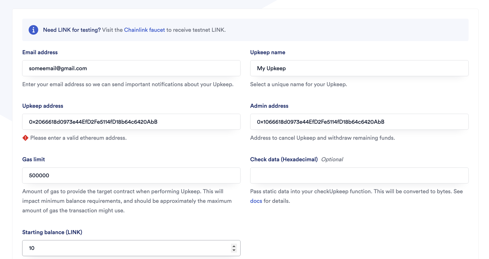

## Requirements
- [foundry](https://getfoundry.sh/)
  - You'll know you did it right if you can run `forge --version` and you see a response like `forge 1.3.5-stable`

## Quickstart

```
cd foundry-smart-contract-lottery
make build
```
# Usage

## Install library and tools
```
make clean install
```

## Build
```
make build
```

## Encrypt private key and put in key store
- Encrypt + put in key store
```
cast wallet import defaultKey --interactive
```
- View stored key
```
cast wallet list
```

## Deploy
Deloy to your local.
```
make deploy
```

Deloy to sepolia (fork)
```
make deploy-sepolia
```

## Testing

```
forge test
```

or

```
forge test --fork-url $SEPOLIA_RPC_URL
```

### Test Coverage

```
forge coverage
```

# Deployment to a testnet or mainnet

1. Setup environment variables

- Add environmet varriables to a `.env` file
    RPC_URL=http://localhost:8545
    SEPOLIA_RPC_URL=https://eth-sepolia.g.alchemy.com/v2/xxxxxxxxxxxxx
    ETHERSCAN_API_KEY=xxxxxxxxxxxxxxxxxx

- `SEPOLIA_RPC_URL`: This is url of the sepolia testnet node you're working with.
- `ETHERSCAN_API_KEY` if you want to verify your contract on [Etherscan](https://etherscan.io/).

2. Get testnet ETH

Head over to [faucets.chain.link](https://faucets.chain.link/) and get some testnet ETH. You should see the ETH show up in your metamask.

2. Deploy

```
make deploy ARGS="--network sepolia"
```

This will setup a ChainlinkVRF Subscription for you. If you already have one, update it in the `scripts/HelperConfig.s.sol` file. It will also automatically add your contract as a consumer.

3. Register a Chainlink Automation Upkeep

[You can follow the documentation if you get lost.](https://docs.chain.link/chainlink-automation/compatible-contracts)

Go to [automation.chain.link](https://automation.chain.link/new) and register a new upkeep. Choose `Custom logic` as your trigger mechanism for automation. Your UI will look something like this once completed:



## Scripts

After deploying to a testnet or local net, you can run the scripts.

Using cast deployed locally example:

```
cast send <RAFFLE_CONTRACT_ADDRESS> "enterRaffle()" --value 0.1ether --private-key <PRIVATE_KEY> --rpc-url $SEPOLIA_RPC_URL
```

or, to create a ChainlinkVRF Subscription:

```
make createSubscription ARGS="--network sepolia"
```

## Estimate gas

You can estimate how much gas things cost by running:

```
forge snapshot
```

And you'll see an output file called `.gas-snapshot`

# Formatting

To run code formatting:

```
forge fmt
```

# Additional Info:
Some users were having a confusion that whether Chainlink-brownie-contracts is an official Chainlink repository or not. Here is the info.
Chainlink-brownie-contracts is an official repo. The repository is owned and maintained by the chainlink team for this very purpose, and gets releases from the proper chainlink release process. You can see it's still the `smartcontractkit` org as well.

https://github.com/smartcontractkit/chainlink-brownie-contracts

## Let's talk about what "Official" means
The "official" release process is that chainlink deploys it's packages to [npm](https://www.npmjs.com/package/@chainlink/contracts). So technically, even downloading directly from `smartcontractkit/chainlink` is wrong, because it could be using unreleased code.

So, then you have two options:

1. Download from NPM and have your codebase have dependencies foreign to foundry
2. Download from the chainlink-brownie-contracts repo which already downloads from npm and then packages it nicely for you to use in foundry.
## Summary
1. That is an official repo maintained by the same org
2. It downloads from the official release cycle `chainlink/contracts` use (npm) and packages it nicely for digestion from foundry.


# Thank Patrick Collins!

If you appreciated this, feel free to follow Patrick Collins or donate!

ETH/Arbitrum/Optimism/Polygon/etc Address: 0x9680201d9c93d65a3603d2088d125e955c73BD65

[](https://twitter.com/PatrickAlphaC)
[](https://www.youtube.com/channel/UCn-3f8tw_E1jZvhuHatROwA)
[](https://www.linkedin.com/in/patrickalphac/)
[](https://medium.com/@patrick.collins_58673/)